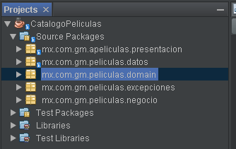
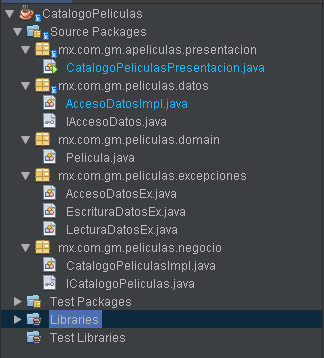
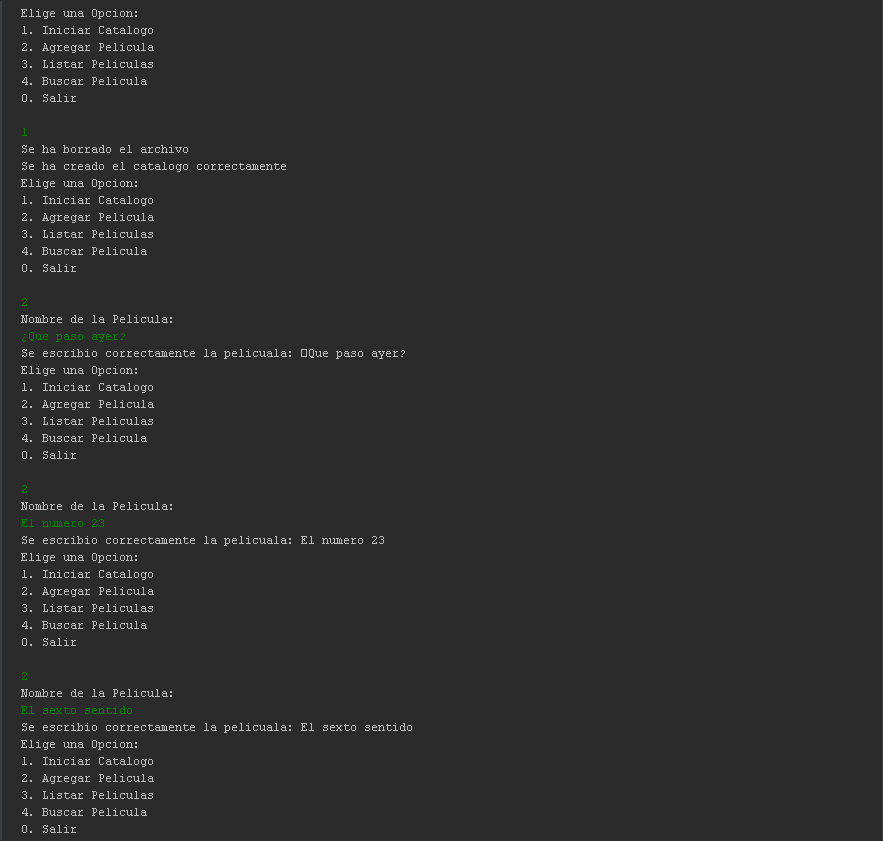

# Java Intermedio II

Este curso de Java abarca una amplia gama de temas importantes para desarrollar habilidades en la programación con este lenguaje. Aprenderás sobre argumentos variables, enumeraciones, bloques de inicialización de código y el manejo de bucles forEach. También explorarás conceptos como autoboxing-unboxing, modificadores de acceso y la sobreescritura de constructores.

El curso continúa con el polimorfismo, el uso de la palabra clave "instanceof" y la conversión de objetos. Además, se cubren temas como la clase Object, clases abstractas y el manejo de interfaces. Conocerás JavaBeans, aprenderás a manejar excepciones y a utilizar la API de colecciones.

El curso también incluye aspectos avanzados como las clases genéricas, el manejo de archivos y el desarrollo de un laboratorio final, donde aplicarás tus conocimientos para crear un catálogo de películas.

Estos temas te proporcionarán una base sólida en Java y te capacitarán para desarrollar aplicaciones robustas y eficientes. No importa si eres principiante o tienes experiencia previa en programación, este curso te ayudará a mejorar tus habilidades y te preparará para enfrentar desafíos en el desarrollo de software utilizando Java.


## Contenido

- Sección 24 Argumentos Variables.

- Sección 25 Enumeraciones.

- Sección 26 Bloques Inicializacion de Codigo.

- Sección 27 Manejo ForEach.

- Sección 28 Autoboxing - Unboxing.

- Sección 29 Modificadores de Acceso.

- Sección 30 Sobreescritura de Constructores.

- Sección 31 Polimorfismo.

- Sección 32 IntanceOf.

- Sección 33 Conversión de Objetos.

- Sección 34 Clase Object.

- Sección 35 Clases Abstractas.

- Sección 36 Manejo de Interfaces.

- Sección 37 JavaBeans.

- Sección 38 Manejo de Excepciones.

- Sección 39 Manejo de RunTimeExceptions.

- Sección 40 Manejo de Excepciones Multiples.

- Sección 41 API Colecciones.

- Sección 42 API Colecciones Genericas.

- Sección 43 Clases Genericas.

- Sección 44 Manejo de Archivos.

- Sección 45 Laboratorio Final (Catalogo de peliculas).


## Instalacion y Ejecucion

- Instala el JDK (Java Development Kit): Descarga e instala la versión adecuada del JDK para tu sistema operativo desde el sitio web oficial de Oracle o de OpenJDK.

- [Descargar JDK 15](https://www.oracle.com/java/technologies/javase/javase8-archive-downloads.html)

- Configura las variables de entorno: Añade la variable de entorno JAVA_HOME que apunte al directorio de instalación del JDK. Añade también la variable de entorno PATH para incluir la ruta al directorio bin del JDK.

- Instala un IDE (Entorno de Desarrollo Integrado): Elige un IDE Java, como Eclipse, IntelliJ IDEA o NetBeans, e instálalo en tu sistema. Estos IDEs proporcionan herramientas y características adicionales para facilitar el desarrollo en Java.

- Configura el IDE: Abre tu IDE y configura la ubicación del JDK. En la configuración, selecciona el directorio de instalación del JDK que has establecido en la variable JAVA_HOME.

- [Descargar NetBeans 12](https://netbeans.apache.org/front/main/index.html)

- Crea un proyecto: Crea un nuevo proyecto en tu IDE o importa uno existente. Configura la configuración del proyecto, como el tipo de proyecto (aplicación de consola, aplicación web, etc.) y las dependencias necesarias.
- Escribe y ejecuta código: Escribe tu código fuente Java en los archivos del proyecto. Utiliza las herramientas y características del IDE para compilar y ejecutar tu código.
- Depuración y pruebas: Utiliza las capacidades de depuración del IDE para identificar y solucionar problemas en tu código. Ejecuta pruebas unitarias para verificar la funcionalidad de tu programa.


    
## Resumen y Analisis

**Sección 24:** Argumentos Variables
En esta sección, aprenderás a trabajar con métodos que pueden recibir un número variable de argumentos. Esto te permitirá escribir métodos más flexibles y versátiles que puedan manejar diferentes cantidades de datos de entrada.

**Sección 25:** Enumeraciones
En esta sección, se exploran las enumeraciones, que son conjuntos de constantes con nombre. Aprenderás cómo definir y utilizar enumeraciones en tus programas para representar conjuntos de valores relacionados.

**Sección 26:** Bloques de Inicialización de Código
En esta sección, se estudian los bloques de inicialización de código y su uso para inicializar variables y ejecutar código antes de la creación de objetos. Esto te permitirá realizar tareas de inicialización más complejas y controlar mejor el estado inicial de tus objetos.

**Sección 27:** Manejo ForEach
En esta sección, se explora el bucle forEach, una forma más sencilla de iterar sobre colecciones y matrices en Java. Aprenderás cómo utilizar este bucle para recorrer los elementos de una colección y realizar operaciones en cada uno de ellos.

**Sección 28:** Autoboxing - Unboxing
En esta sección, se aborda el concepto de autoboxing y unboxing, que es la conversión automática entre tipos primitivos y sus correspondientes envoltorios (wrapper classes). Aprenderás cómo Java realiza esta conversión de forma automática y cómo aprovecharla en tu código.

**Sección 29:** Modificadores de Acceso
En esta sección, se explican los modificadores de acceso (public, private, protected) y su impacto en la encapsulación y el acceso a variables y métodos. Aprenderás cómo utilizar estos modificadores para controlar la visibilidad y el acceso a los miembros de una clase.

**Sección 30:** Sobreescritura de Constructores
En esta sección, se estudia la sobreescritura de constructores en clases hijas y cómo gestionar la herencia en Java. Aprenderás cómo personalizar la inicialización de objetos en clases derivadas y cómo utilizar constructores en la jerarquía de herencia.

**Sección 31:** Polimorfismo
En esta sección, se introduce el polimorfismo, que permite tratar objetos de diferentes clases de manera uniforme. Aprenderás a redefinir métodos en clases derivadas y a utilizar el polimorfismo para escribir código más flexible y reutilizable.

**Sección 32:** InstanceOf
En esta sección, se explora la palabra clave "instanceof", que se utiliza para comprobar si un objeto es de un determinado tipo o una subclase de ese tipo. Aprenderás cómo utilizar "instanceof" para realizar comprobaciones de tipo y tomar decisiones basadas en ellas.

**Sección 33:** Conversión de Objetos
En esta sección, se aprende a convertir objetos entre diferentes tipos y a manejar posibles excepciones que puedan surgir en el proceso. Aprenderás técnicas para realizar conversiones seguras y cómo utilizar el mecanismo de excepciones en Java.

**Sección 34:** Clase Object
En esta sección, se explora la clase Object, que es la clase base de todas las clases en Java. Aprenderás sobre los métodos comunes proporcionados por la clase Object y cómo utilizarlos en tus propias clases.

**Sección 35:** Clases Abstractas
En esta sección, se introduce el concepto de clases abstractas, que no se pueden instanciar y proporcionan una estructura común para las clases hijas. Aprenderás cómo definir clases abstractas y cómo utilizarlas para establecer una base común en tu jerarquía de clases.

**Sección 36:** Manejo de Interfaces
En esta sección, se explora el manejo de interfaces en Java. Aprenderás cómo definir interfaces y cómo utilizarlas para establecer contratos y permitir que las clases implementen múltiples interfaces. También se estudia cómo utilizar interfaces para lograr el polimorfismo.

**Sección 37:** JavaBeans
En esta sección, se estudian los JavaBeans, que son componentes reutilizables en Java. Aprenderás cómo construir JavaBeans siguiendo el estándar y cómo utilizarlos en tus programas para lograr una mayor modularidad y reutilización de código.

**Sección 38:** Manejo de Excepciones
En esta sección, se aborda el manejo de excepciones en Java. Aprenderás a utilizarLamento la interrupción anterior. Aquí tienes un resumen breve de los puntos restantes:
Sección 38: Manejo de Excepciones
En esta sección, aprenderás a manejar excepciones en Java. Conocerás cómo utilizar bloques try-catch para capturar y manejar excepciones, así como también cómo lanzar y definir tus propias excepciones personalizadas.

**Sección 39:** Manejo de RunTimeExceptions
En esta sección, se profundiza en el manejo de excepciones en tiempo de ejecución (RuntimeExceptions). Aprenderás a identificar y manejar estas excepciones específicas, así como también a utilizar bloques try-catch-finally para asegurar la liberación de recursos importantes.

**Sección 40:** Manejo de Excepciones Múltiples
En esta sección, se explora el manejo de múltiples excepciones en Java. Aprenderás a manejar diferentes tipos de excepciones de manera eficiente y a utilizar la jerarquía de excepciones para capturar y tratar excepciones de manera más específica.

**Sección 41:** API Colecciones
En esta sección, se introduce la API de colecciones en Java. Aprenderás sobre las interfaces y clases principales de la API de colecciones, como List, Set y Map, y cómo utilizarlas para almacenar y manipular conjuntos de objetos de manera eficiente.

**Sección 42:** API Colecciones Genéricas
En esta sección, se explora el uso de genéricos en la API de colecciones. Aprenderás cómo utilizar tipos genéricos para crear colecciones seguras en cuanto a tipos y cómo aprovechar los beneficios de la inferencia de tipos en Java.

**Sección 43:** Clases Genéricas
En esta sección, se profundiza en la implementación de clases genéricas en Java. Aprenderás a crear tus propias clases genéricas y a utilizar tipos genéricos para hacer que tus clases sean más flexibles y reutilizables.

**Sección 44:** Manejo de Archivos
En esta sección, se explora el manejo de archivos en Java. Aprenderás a crear, leer, escribir y manipular archivos utilizando las clases y métodos proporcionados por la API de manejo de archivos en Java.


## Proyecto Final

El mini proyecto consiste en desarrollar un catálogo de películas de solo texto utilizando Java como parte del laboratorio final del curso. El catálogo permite almacenar los nombres de las películas en un archivo de texto, utilizando el bloc de notas como medio de almacenamiento.

El programa permite al usuario realizar las siguientes acciones:

Agregar una película al catálogo: El usuario puede ingresar el nombre de una película y el programa se encarga de almacenarla en el archivo de texto.
Ver el catálogo completo: El programa muestra en la consola todos los nombres de las películas almacenadas en el archivo de texto.
Buscar una película: El usuario puede buscar una película específica ingresando su nombre, y el programa mostrará si está presente en el catálogo.
Eliminar una película: El usuario puede eliminar una película del catálogo ingresando su nombre, y el programa la eliminará tanto del catálogo como del archivo de texto.
Salir del programa: El usuario puede finalizar la ejecución del programa.
El catálogo de películas utiliza la lectura y escritura de archivos en Java para interactuar con el archivo de texto que almacena los nombres de las películas. El objetivo principal del proyecto es aplicar los conocimientos adquiridos durante el curso de Java, como el manejo de archivos, estructuras de control y manipulación de cadenas, para crear una aplicación funcional y práctica.


- Paquetes





- Resultado


## Ejemplo de Codigo

- Clase CatalogoPeliculasPresentacion 

```java
package mx.com.gm.apeliculas.presentacion;

import java.util.Scanner;
import mx.com.gm.peliculas.negocio.*;

public class CatalogoPeliculasPresentacion {
    public static void main(String[] args) {
        //Variable de la opcion que controla que se ejecuta del menu
        int opcion = -1;
        //Clase Scanner para resivir datos del teclado
        Scanner escanear = new Scanner(System.in);
        /*Variable tipo ICatalogoPeliculas y que apunta a la clase CatalogoPeliculasImpl 
          para poder usar los metodos de la clase CatalogoPeliculasImpl*/ 
        CatalogoPeliculasImpl catalogo = new CatalogoPeliculasImpl();
        
        //Se ejecuta este ciclo con el menu mientras la opcion no sea cero
        while (opcion != 0) {            
            System.out.println("Elige una Opcion: \n"
                    + "1. Iniciar Catalogo\n"
                    + "2. Agregar Pelicula\n"
                    + "3. Listar Peliculas\n"
                    + "4. Buscar Pelicula\n"
                    + "0. Salir\n");
            opcion = Integer.parseInt(escanear.nextLine());
            
            //Condiciobal con las opciones a ejecutar
            switch(opcion){
                
                case 1: //Iniciar o crear el catalago
                    catalogo.iniciarCatalogoPeliculas();
                    break;
                case 2://Agregapelicula al catalago se pide ingresar desde teclado el nombre de la pelicula
                    System.out.println("Nombre de la Pelicula: ");
                    String nombrePelicula = escanear.nextLine();
                    catalogo.agregarPelicula(nombrePelicula);
                    break;
                case 3://Imprimimos la lista de las peliculas del catalago
                    catalogo.listarPelicula();
                    break;
                case 4://Buscar pelicula en el catalago se pide ingresar desde teclado el nombre de la pelicula
                    System.out.println("¿Cual pelicula buscas? ");
                    String buscar = escanear.nextLine();
                    catalogo.buscarPelicula(buscar);
                    break;
                case 0://Salir del menu y finalizar el programa
                    System.out.println("Hasta Pronto");
                    break;
                default://Ninguna opcion valida
                    System.out.println("Opcion desconocida");
                    break;
            }
        }
    }
}
```

- Clase IAccesoDatos

```java
package mx.com.gm.peliculas.datos;

import java.util.List;
import mx.com.gm.peliculas.domain.Pelicula;
import mx.com.gm.peliculas.excepciones.*;

//Creacion de la interface
public interface IAccesoDatos {
   
                    //Creacion de metodos
    
    //Comprueba si existe el archivo
    boolean existe(String nombreRecurso) throws AccesoDatosEx;
    
    //Coloca en una lista los datos que estan dentro del archivo
    List<Pelicula> listar(String nombreRecurso) throws LecturaDatosEx;
    
    //Escribe dentro del archivo
    void escribir(Pelicula pelicula, String nombreRecurso, boolean anexar) throws EscrituraDatosEx;
    
    //Busca dentro del archivo
    String buscar(String nombreRecurso, String buscar) throws LecturaDatosEx;
    
    //Crea el archivo
    void crear(String nombreRecurso) throws AccesoDatosEx;
    
    //Elimina el archivo
    void borrar(String nombreRecurso) throws AccesoDatosEx;

```

- Clase Pelicula

```java
package mx.com.gm.peliculas.domain;

//Esta es la clase donde se crea el objeto pelicula
public class Pelicula {

    //Variable del nombre de la pelicula
    private String nombre;

    //Constructor vacio
    public Pelicula() {
    }

    //Constructor que referencia al objeto pelicula
    public Pelicula(String nombre) {
        this.nombre = nombre;
    }

    //Metodos setter y getter
    
    public String getNombre() {
        return nombre;
    }

    public void setNombre(String nombre) {
        this.nombre = nombre;
    }

    @Override
    public String toString() {
        return this.nombre;
    }
}
```


- Clases AccesoDatos, EscrituraDatos y LecturaDatos

```java
package mx.com.gm.peliculas.excepciones;

//La clase debe de extender de la clase exception 
public class AccesoDatosEx extends Exception {

    //Dentro del constructor se llama al constructor de la clase padre
    public AccesoDatosEx(String mensaje) {
        super(mensaje);
    }
}

```
```java
package mx.com.gm.peliculas.excepciones;

//Aqui se extiende de la clase AccesoDatosEx 
public class EscrituraDatosEx extends AccesoDatosEx{
    
    // Tambien se manda a llamar el constructor de esa clase con super
    public EscrituraDatosEx(String mensaje) {
        super(mensaje);
    }
    
}

```
```java
package mx.com.gm.peliculas.excepciones;

//Aqui se extiende de la clase AccesoDatosEx 
public class LecturaDatosEx extends AccesoDatosEx{
    
    // Tambien se manda a llamar el constructor de esa clase con super
    public LecturaDatosEx(String mensaje) {
        super(mensaje);
    }
    
}


```


- Clase CatalogoPeliculasImpl

```java
package mx.com.gm.peliculas.negocio;

import java.util.List;
import mx.com.gm.peliculas.datos.*;
import mx.com.gm.peliculas.domain.Pelicula;
import mx.com.gm.peliculas.excepciones.*;

//En la clase se debe implementar la interface de ICatalogoPeliculas
public class CatalogoPeliculasImpl implements ICatalogoPeliculas {

    //Variable de tipo de la interface IAccesoDatos
    private final IAccesoDatos datos;

    //Constructor sin argumentos para inicializar la variable datos
    public CatalogoPeliculasImpl() {
        /*Esta variable apunta hacia la clase AccesoDatosImpl donde estan implementados 
          los metodos de la interface IAccesoDatos*/
        this.datos = new AccesoDatosImpl();
    }

    //Aqui agregaremos las peliculas al catalago pasamos de parametro el nombre de la pelicula
    @Override
    public void agregarPelicula(String nombrePelicula) {
        //Creamos el objeto de tipo pelicula y le pasamos el nombre de la pelicula que se va a agregar
        Pelicula pelicula = new Pelicula(nombrePelicula);
        //Creamos la variable booleana con el valor de false
        boolean anexar = false;

        //Capturamos el error que se propago desde el metodo existe el catalago
        try {
            //Aqui comprobamos si existe el catalago donde se va agregar la pelicula
            anexar = datos.existe(NOMBRE_RECURSO);
            /*Escribimos la pelicula en el catalago pasamos 3 parametros 
              nombre pelicula, nombre catalago y la variable booleana para saber si existe el catalago o no*/
            datos.escribir(pelicula, NOMBRE_RECURSO, anexar);
        } catch (AccesoDatosEx ex) {
            //Se decidio mostrar el error aqui y no propagar mas, pero si se puede propagar al siguiente metodo 
            System.out.println("Error de Acceso a datos");
            ex.printStackTrace(System.out);
        }
    }

    
    //Mostramos la lista de peliculas en el catalago
    @Override
    public void listarPelicula() {
        //Capturamos la excepcion propagada que viene del metodo
        try {
            //insertamos el contenido dentro de la lista
            List<Pelicula> peliculas = this.datos.listar(NOMBRE_RECURSO);
            //Con un ForEach imprimimos todo el contenido de esa lista
            for(Pelicula pelicula: peliculas){
                System.out.println("pelicula = " + pelicula);
            }
        } catch (LecturaDatosEx ex) {
            System.out.println("Error al listar los datos");
            ex.printStackTrace(System.out);
        }
    }

    
    //Buscamo una pelicula en especifico
    @Override
    public void buscarPelicula(String buscar) {
        //Varible donde se va a almacenar el resultado
        String resultado = null;
        //Capturamos la excepcion propagada que viene del metodo
        try {
            /*Ejecutamos el metodo buscar de la clase AccesoDatosImpl y pasmos de parametros
              el nombre del catalago y el nomber de la pelicula a buscar*/
            resultado = this.datos.buscar(NOMBRE_RECURSO, buscar);
        } catch (AccesoDatosEx ex) {
            System.out.println("Error al buscar pelicula en el archivo");
            ex.printStackTrace(System.out);
        }
        //Mostramos el resultado en pantalla
        System.out.println(" resultado = " + resultado);
    }

    //Creamos el catalago
    @Override
    public void iniciarCatalogoPeliculas() {
        //Capturamos la excepcion propagada que viene del metodo
        try {
            //Se comprueba si existe el catalago si existe se borra y se crea otra vez
            if (this.datos.existe(NOMBRE_RECURSO)) {
                datos.borrar(NOMBRE_RECURSO);
                datos.crear(NOMBRE_RECURSO);
            } else{
                //Si no existe solo se crea
                datos.crear(NOMBRE_RECURSO);
            }
        } catch (AccesoDatosEx ex) {
            System.out.println("Error al iniciar catalogo de peliculas: ");
            ex.printStackTrace(System.out);
        }
    }

}
```
## Autor

- [@GabrielTorrealba](https://github.com/GabrielJose2102)

